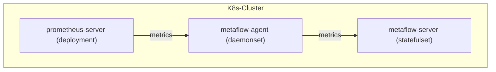

# 数据流



# 配置 Prometheus

## 安装 Prometheus

在 [Prometheus文档](https://prometheus.io/docs/introduction/overview/) 中可了解相关背景知识，如果你的集群中没有 Prometheus ，可用如下步骤在 `metaflow-prometheus-demo` 快速部署一个 Prometheus 应用。 

1. 添加 Helm Chart

```bash
helm repo add prometheus-community https://prometheus-community.github.io/helm-charts
helm repo update
```

2. 安装 Prometheus

```bash
helm install prometheus prometheus-community/prometheus -n metaflow-prometheus-demo --create-namespace -f values.yaml
```

## 配置 remote_write

我们需要在 Prometheus 的配置文件中修改配置，并使 Prometheus 对接到 MetaFlow Agent。

其中，我们需要确定 MetaFlow Agent 启动的数据监听服务的地址。在 [安装 MetaFlow Agent](../../install/single-k8s/) 后，会显示 MetaFlow Agent Service 地址，它的默认值是 `metaflow-agent.default`。如果你修改了它，请根据实际的服务名称与命名空间填写到配置中。

```bash
METAFLOW_AGENT_SVC=xxxx #FIXME
```

接下来，我们执行以下命令，修改 Prometheus 的默认配置。

其中，${PROMETHEUS_NS} 是你的环境中的 Prometheus 所在的命名空间，如果你跟随着 [安装 Prometheus](#安装-prometheus) 中的步骤完成安装，请把它设置为 `metaflow-prometheus-demo` 。

```bash
PROMETHEUS_NS=xxxx #FIXME

kubectl edit cm -n ${PROMETHEUS_NS} prometheus-server 
```

在 `prometheus.yml` 配置中，增加如下内容。其中，`METAFLOW_AGENT_SVC` 请填写为上述步骤获取到的地址。

```yaml
remote_write:
  - url: http://${METAFLOW_AGENT_SVC}/api/v1/prometheus
```

# 配置 MetaFlow

请参考 [配置MetaFlow](../tracing/opentelemetry/#配置-metaflow) 一节内容，完成 MetaFlow Agent 配置。
