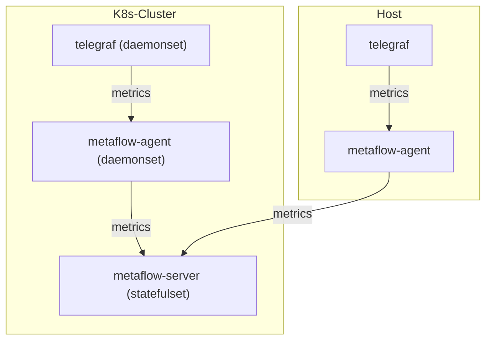

# 数据流



# 配置 Telegraf

## 安装 Telegraf 

在 [Telegraf文档](https://www.influxdata.com/time-series-platform/telegraf/) 中可了解相关背景知识。如果你的集群中没有 Telegraf ，可用如下步骤快速部署一个 Telegraf 应用。

1. 添加 Helm Chart

```bash
helm repo add influxdata https://helm.influxdata.com/
```

2. 安装 Telegraf
```bash
helm upgrade --install telegraf influxdata/telegraf -n metaflow-telegraf-demo --create-namespace -f values.yaml
```

## 部署模式修改

Telegraf 的 Helm Chart 默认使用了 Deployment 部署模式来启动应用，但我们推荐使用 Daemonset 来进行管理，可执行以下命令修改部署模式：

```bash
kubectl apply -f https://raw.githubusercontent.com/metaflowys/metaflow-demo/main/metaflow-telegraf-demo/metaflow-telegraf-demo.yaml
```

## 配置 Telegraf 数据输出

我们需要在 Telegraf 的配置文件中，修改 Telegraf 的配置，使 Telegraf 对接到 MetaFlow Agent。

其中，我们需要确定 MetaFlow Agent 启动的数据监听服务的地址。在 [安装 MetaFlow Agent](../../install/single-k8s/) 后，会显示 MetaFlow Agent Service 地址，它的默认值是 `metaflow-agent.default`。如果你修改了它，请根据实际的服务名称与命名空间填写到配置中。

```bash
METAFLOW_AGENT_SVC=xxxx #FIXME
```

接下来，修改 Telegraf 的默认配置。其中，${TELEGRAF_NS} 是你的集群中 Telegraf 所在的命名空间。如果你跟随 [安装 Telegraf](#安装-telegraf) 中的步骤完成了 Telegraf 的安装，请将它设置为 `metaflow-telegraf-demo` 。

接下来，请执行以下命令修改配置：

```bash
TELEGRAF_NS=xxxx #FIXME

kubectl edit cm -n ${TELEGRAF_NS} telegraf
```

在 `telegraf.conf` 中，增加如下配置：

```toml
[[outputs.http]]
  url = "http://${METAFLOW_AGENT_SVC}/api/v1/telegraf"
  data_format = "influx"
```

# 配置 MetaFlow

请参考 [配置MetaFlow](../tracing/opentelemetry/#配置-metaflow) 一节内容，完成 MetaFlow Agent 配置。
