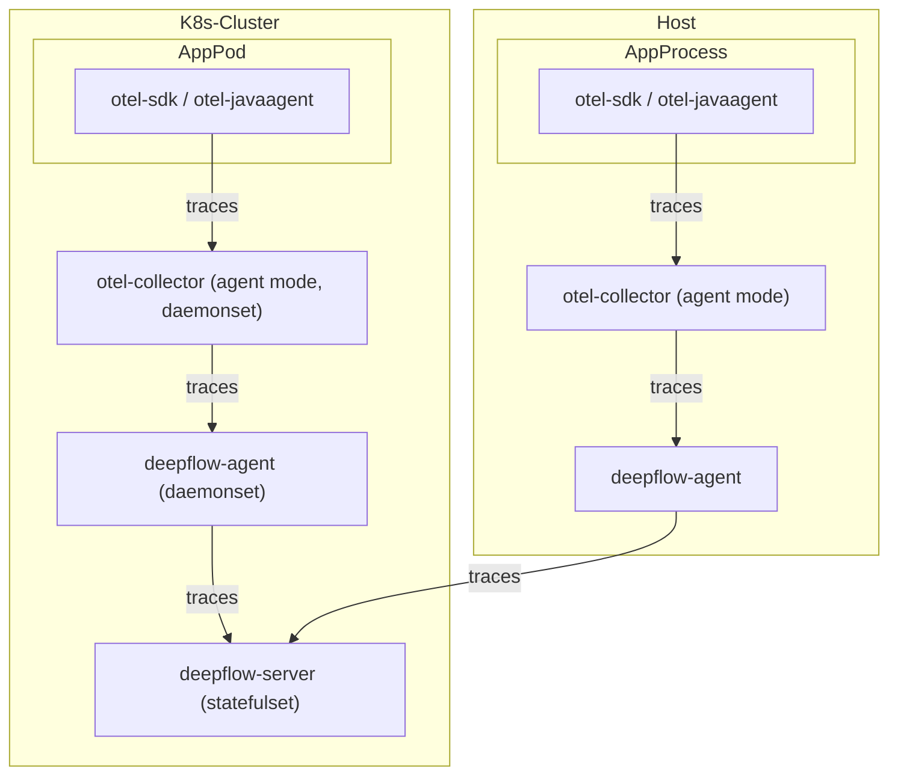
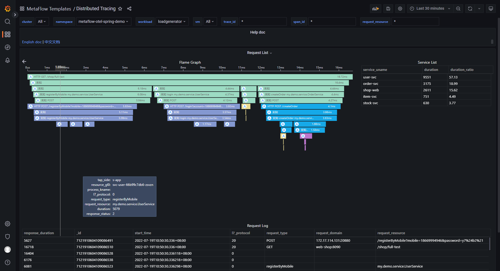
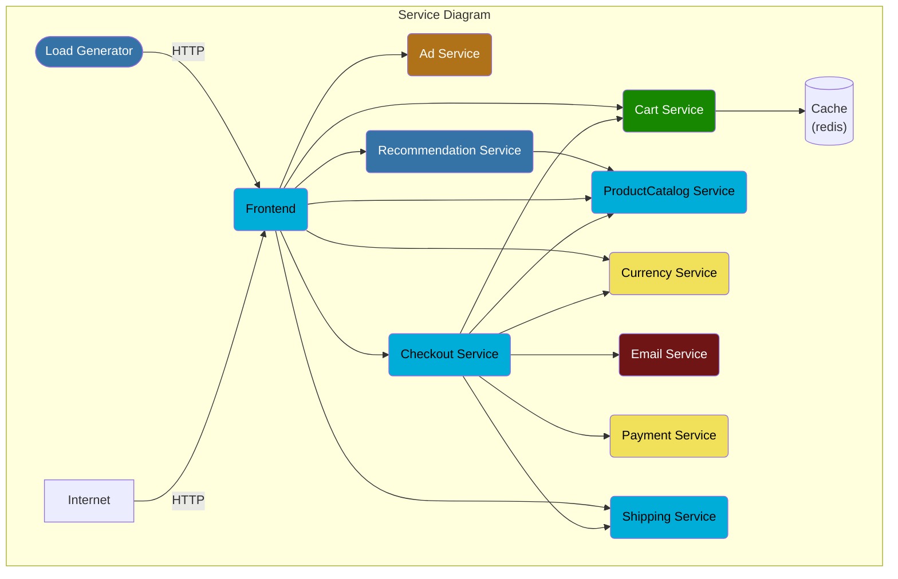

# 数据流



# 配置 OpenTelemetry

我们推荐使用 agent 模式的 otel-collector 向 deepflow-agent 发送 trace 数据，以避免数据跨 K8s 节点传输。
当然使用 gateway 模式的 otel-collector 也是完全可行的。以下的文档中以 otel-agent 为例介绍部署和配置方法。

## 安装 otel-agent

查看 [OpenTelemetry 文档](https://opentelemetry.io/docs/) 可了解相关背景知识。
如果你的环境中还没有 OpenTelemetry，可以使用如下命令在 `open-telemetry` 命名空间中快速部署一个 otel-agent DaesmonSet：
```bash
kubectl apply -n open-telemetry -f https://raw.githubusercontent.com/deepflowys/deepflow-demo/main/open-telemetry/open-telemetry.yaml
```

安装完毕之后，可以在环境里看到这样一个组件清单：
```bash
kubectl get all -n open-telemetry
```

| Type | Component |
| --- | --- |
| Daemonset | otel-agent |
| Service | otel-agent |
| ConfigMap | otel-agent |

如果你需要使用其他版本或更新的 opentelemetry-collector-contrib，
请在 [otel-docker](https://hub.docker.com/r/otel/opentelemetry-collector-contrib/tags) 仓库中，
找到你想要的镜像版本，然后使用如下命令更新镜像：
```bash
LATEST_TAG="xxx"  # FIXME

kubectl set image -n open-telemetry daemonset/otel-agent otel-agent=otel/opentelemetry-collector-contrib:${LATEST_TAG}
```

## 配置 otel-agent

我们需要配置 otel-agent ConfigMap 中的 `otel-agent-config.exporters.otlphttp`，将 trace 发送至 DeepFlow。首先查询当前配置：
```bash
kubectl get cm -n open-telemetry otel-agent-conf -o custom-columns=DATA:.data | \
    grep -A 5 otlphttp:
```

deepflow-agent 使用 NodePort 接收 trace，默认端口为 38086，将 otel-agent 的配置进行修改：
```yaml
otlphttp:
  traces_endpoint: "http://${HOST_IP}:38086/api/v1/otel/trace"
  tls:
    insecure: true
  retry_on_failure:
    enabled: true
```

# 配置 DeepFlow

接下来我们需要开启 deepflow-agent 的数据接收服务。

首先我们确定 deepflow-agent 所在的采集器组 ID，一般为名为 default 的组的ID：
```bash
deepflow-ctl agent-group list
```

确认该采集器组是否已经有了配置：
```bash
deepflow-ctl agent-group-config list
```

若已有配置，将其导出至 yaml 文件中便于进行修改：
```bash
deepflow-ctl agent-group-config list <your-agent-group-id> > your-agent-group-config.yaml
```

修改 yaml 文件，确认包含如下配置项：
```bash
vtap_group_id: <your-agent-group-id>
external_agent_http_proxy_enabled: 1   # required
external_agent_http_proxy_port: 38086  # optional, default 38086
```

更新采集器组的配置：
```
deepflow-ctl agent-group-config update <your-agent-group-id> -f your-agent-group-config.yaml
```

如果采集器组还没有配置，可使用如下命令基于 your-agent-group-config.yaml 文件新建配置：
```bash
deepflow-ctl agent-group-config create -f your-agent-group-config.yaml
```

# 基于 Spring Boot Demo 体验

## 部署 Demo

此Demo来源于 [这个 GitHub 仓库](https://github.com/liuzhibin-cn/my-demo)，这是一个基于 Spring Boot 编写的由五个微服务组成的 WebShop 应用，其架构如下：


使用如下命令可以一键部署这个 Demo：
```bash
kubectl apply -n deepflow-otel-spring-demo -f https://raw.githubusercontent.com/deepflowys/deepflow-demo/main/deepflow-otel-spring-demo/deepflow-otel-spring-demo.yaml
```

## 查看追踪数据

前往 Grafana，打开 `Distributed Tracing` Dashboard，选择 `namespace = deepflow-otel-spring-demo` 后，可选择一个调用进行追踪。
DeepFlow 能够将 OpenTelemetry、eBPF、BPF 获取到的追踪数据关联展示在一个 Trace 火焰图中，
覆盖一个 Spring Boot 应用从业务代码、系统函数、网络接口的全栈调用路径，实现真正的全链路分布式追踪，效果如下：



你也可以访问 [DeepFlow Online Demo](https://ce-demo.deepflow.yunshan.net/d/a3x57qenk/distributed-tracing?orgId=1&var-cluster=All&var-namespace=12&var-workload=All&var-vm=All&var-trace_id=*&var-span_id=*&var-request_resource=*&from=now-5m&to=now&from=deepflow-doc) 查看效果。

# 基于 OpenTelemetry WebStore Demo 体验

## 部署 Demo

此 Demo 来源于 [opentelemetry-webstore-demo](https://github.com/open-telemetry/opentelemetry-demo-webstore)，
这个 Demo 由 Go、C#、Node.js、Python、Java 等语言实现的十多个微服务组成，它的应用架构如下：


使用如下命令可以一键部署这个 Demo：
```bash
kubectl apply -n deepflow-otel-grpc-demo -f https://raw.githubusercontent.com/deepflowys/deepflow-demo/main/deepflow-otel-grpc-demo/deepflow-otel-grpc-demo.yaml
```

## 查看追踪数据

前往 Grafana，打开 `Distributed Tracing` Dashboard，选择 `namespace = deepflow-otel-grpc-demo` 后，可选择一个调用进行追踪。
DeepFlow 能够将 OpenTelemetry、eBPF、BPF 获取到的追踪数据关联展示在一个 Trace 火焰图中，
覆盖一个多语言应用从业务代码、系统函数、网络接口的全栈调用路径，实现真正的全链路分布式追踪，效果如下：


你也可以访问 [DeepFlow Online Demo](https://ce-demo.deepflow.yunshan.net/d/a3x57qenk/distributed-tracing?orgId=1&var-cluster=All&var-namespace=13&var-workload=62&var-vm=All&var-trace_id=*&var-span_id=*&var-request_resource=*&from=now-5m&to=now&from=deepflow-doc) 查看效果。
