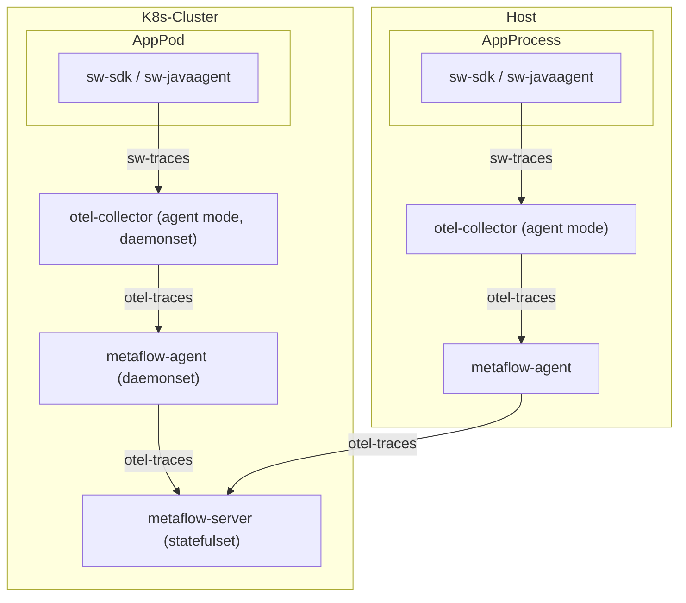
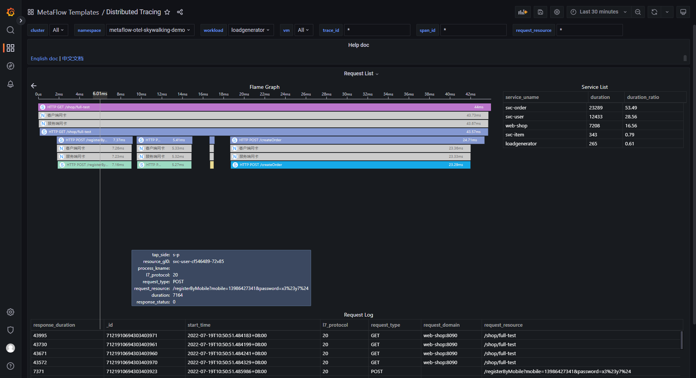

# 数据流



# 配置 OpenTelemetry Skywalking Receiver

## 背景知识

你可以查看 [OpenTelemetry 文档](https://opentelemetry.io/docs/) 了解 OpenTelemetry 背景知识，并参考 [OpenTelemetry安装](../tracing/opentelemetry/#配置-opentelemetry) 快速完成 OpenTelemetry 安装。

你可以查看 [Skywalking 文档](https://skywalking.apache.org/docs/) 了解 Skywalking 背景知识，这个 Demo 可以不安装 Skywalking ，而是使用 OpenTelemetry 来集成 Skywalking Trace 数据。

## 配置 OpenTelemetry

首先，你需要开启 OpenTelemetry 的 Skywalking 数据接收能力，将数据经过 OpenTelemetry 标准协议处理之后，发送到 MetaFlow Agent。

因为 OpenTelemetry 接收 Skywalking 数据的功能是在 [这个PR](https://github.com/open-telemetry/opentelemetry-collector-contrib/pull/11562) 之后才变得完善，所以我们需要 OpenTelemetry 的 [Collector 镜像](https://hub.docker.com/r/otel/opentelemetry-collector-contrib) 版本要在 0.56.0 及以上，才能完整包含这项能力。

请检查你的环境中 otel-agent 的镜像版本，并确保它符合要求。可参考 [OpenTelemetry安装](../tracing/opentelemetry/#配置-otel-agent) 中的更新镜像命令，更新你的环境中的 otel-agent 版本。

1. 修改 OpenTelemetry 的配置文件

其中，OTEL_NS 是 OpenTelemetry 所在的命名空间，OTEL_AGENT_CONF 是 OpenTelemetry Collector 启动时使用的配置文件。

```bash
OTEL_NS=xxxx #FIXME

OTEL_AGENT_CONF=xxxx #FIXME
```

我们以 [OpenTelemetry安装](../tracing/03-opentelemetry/#配置-opentelemetry) 部署后的应用为例，修改这两项配置，并继续后面的操作。

```bash
OTEL_NS=open-telemetry

OTEL_AGENT_CONF=otel-agent-conf
```

接下来，执行命令，修改 OpenTelemetry 的配置。

```bash
kubectl edit cm -n ${OTEL_NS} ${OTEL_AGENT_CONF}
```

2. 在 Receivers 一节中，增加如下内容：

```yaml
receivers:
  # 以下为增加的内容
  skywalking:
    protocols:
      grpc:
        endpoint: 0.0.0.0:11800
      http:
        endpoint: 0.0.0.0:12800
```

在 Pipeline 一节中，将增加的 skywalking 添加到 Trace Pipeline，如下所示

```yaml
service:
  pipelines:
    traces:
      # 在 receivers 中增加 skywalking
      receivers: [skywalking]
```

4. 最后，重启 otel-agent 完成应用更新。

```bash
kubectl rollout restart -n ${OTEL_NS} daemonset/otel-agent
```

# 配置 MetaFlow

请参考 [配置MetaFlow](../tracing/opentelemetry/#配置-metaflow) 一节内容，完成 MetaFlow Agent 配置。

# 基于 Dubbo ShopWeb Demo 体验

## 部署 Demo

此Demo来源于 [这个 GitHub 仓库](https://github.com/liuzhibin-cn/my-demo)，这是一个基于 Spring Boot 编写的由五个微服务组成的 WebShop 应用，其架构如下：


使用如下命令可以一键部署这个 Demo：
```bash
kubectl apply -n metaflow-otel-spring-demo -f https://raw.githubusercontent.com/metaflowys/metaflow-demo/main/metaflow-otel-spring-demo/metaflow-otel-spring-demo.yaml
```

## 查看追踪数据

前往 Grafana，打开 `Distributed Tracing` Dashboard，选择 `namespace = metaflow-otel-skywalking-demo` 后，可选择一个调用进行追踪，效果如下图：


你也可以访问 [MetaFlow Online Demo](https://demo.metaflow.yunshan.net/d/a3x57qenk/distributed-tracing?orgId=1&var-cluster=All&var-namespace=15&var-workload=All&var-vm=All&var-trace_id=*&var-span_id=*&var-request_resource=*&from=now-5m&to=now&from=metaflow-doc) 查看效果。
