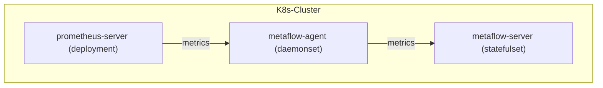

# 数据流

```mermaid
flowchart TD

subgraph K8s-Cluster
  Prometheus["prometheus-server (deployment)"]
  MetaFlowAgent["metaflow-agent (daemonset)"]
  MetaFlowServer["metaflow-server (statefulset)"]

  Prometheus -->|metrics| MetaFlowAgent
  MetaFlowAgent -->|metrics| MetaFlowServer
end
```

# 配置 Prometheus

TODO @嘉炜 @建昌

# 配置 MetaFlow

TODO @嘉炜

# 部署 All-in-One Prometheus 体验

TODO @嘉炜 @建昌
