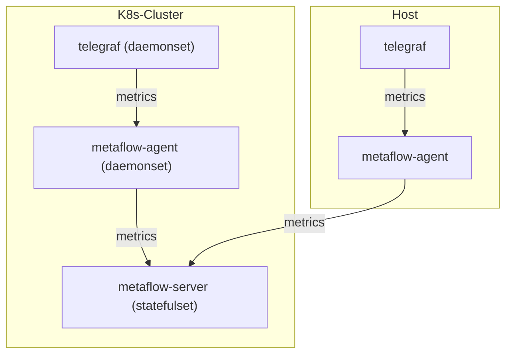

# 数据流

```mermaid
flowchart TD

subgraph K8s-Cluster
  Telegraf1["telegraf (daemonset)"]
  MetaFlowAgent1["metaflow-agent (daemonset)"]
  MetaFlowServer["metaflow-server (statefulset)"]

  Telegraf1 -->|metrics| MetaFlowAgent1
  MetaFlowAgent1 -->|metrics| MetaFlowServer
end

subgraph Host
  Telegraf2[telegraf]
  MetaFlowAgent2[metaflow-agent]

  Telegraf2 -->|metrics| MetaFlowAgent2
  MetaFlowAgent2 -->|metrics| MetaFlowServer
end
```

# 配置 Telegraf

TODO @嘉炜 @建昌

# 配置 MetaFlow

TODO @嘉炜

# 部署 Telegraf 体验

TODO @嘉炜 @建昌
